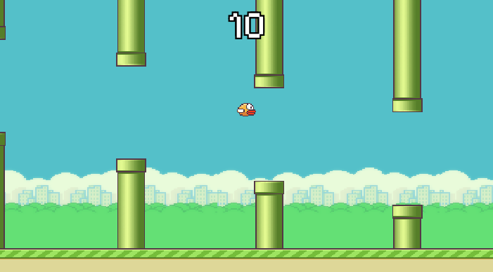

# Flappy Bird

Flappy Bird is a simple, yet challenging arcade-style game. Players control a small, pixelated bird by tapping the screen (or pressing a button) to make it flap its wings and ascend. The objective is to navigate the bird through a series of green pipes without hitting them. Each successful pass through a set of pipes awards the player a point, and the goal is to achieve the highest score possible.

You can play from [HERE](https://noir-games.itch.io/flappy-bird)
